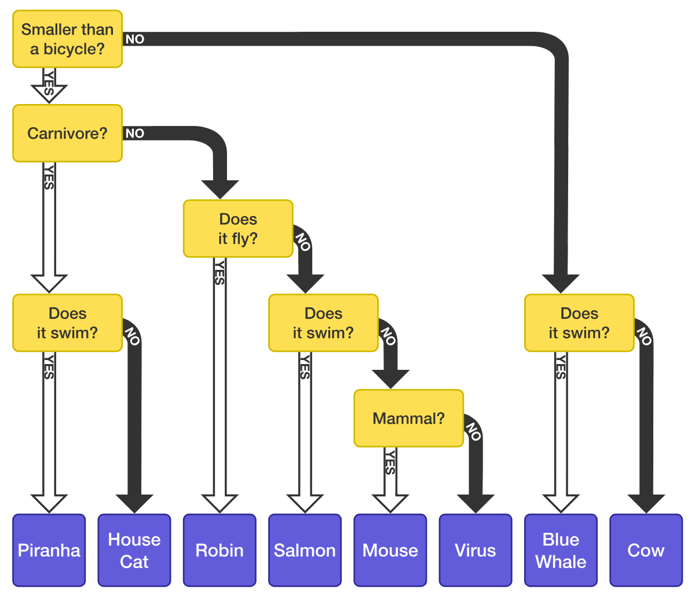
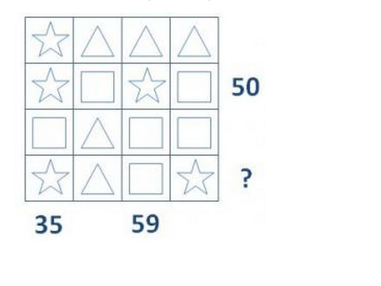
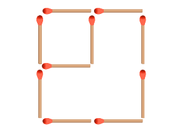

### Joseph, Kevin, and Nicholas are 3 brothers. If the following statements are all true, which of them is the youngest?
> Joseph is not the youngest.  
> Kevin is the oldest.  
> Nicholas is not the oldest.

1. Joseph
2. Kevin
3. Nicholas

### Five brothers compare their heights in the following way. Who is the tallest?
> Alex is taller than Brian but shorter than Charlie;  
> Daniel is taller than Edward but shorter than Alex.  

1. Alex
2. Brian
3. Charlie
4. Daniel
5. Edward
6. Not enough information

> All Bigfoots are monsters.  
> All monsters are scary.  
> Therefore, all Bigfoots are scary.  

1. The argument is valid
2. The argument is invalid

### A computer is using this decision tree. Which of these creatures will require the computer to ask the most amount of questions?

1. House Cat
2. Salmon
3. Mouse
4. Cow

### Which of these questions should you ask if you want to split the images below into two equally sized groups?

1. Do they have long hair?
2. Are they smiling?
3. Do they have brown hair?
4. Are they wearing glasses?
5. None of these will work.

### There are 2 squares of different sizes. What is the minimum number of matchsticks that we have to move in order to end up with exactly 3 squares? The squares may or may not be of different sizes.

1. 1
2. 2
3. 3
4. 4

### Using only the operators `+` and `-` how should the blanks be filled in to make the equation true?
`1 [ ] 2 [ ] 3 [ ] 4 = 6`

1. `-, +, +`
2. `+, -, +`
3. `+, +, -`
4. `-, -, +`

### Mary’s mum has four children. The first child is called April. The second May. The third June. What is the name of the fourth child?

1. July
2. August
3. September
4. Mary

### What number should replace the question mark?

1. 44
2. 46
3. 52

### What is the next number in the following sequence?
`4, 16, 5, 25, 6, 36, 7, 49, 8, ...`

1. 56
2. 64
3. 36
4. 52
